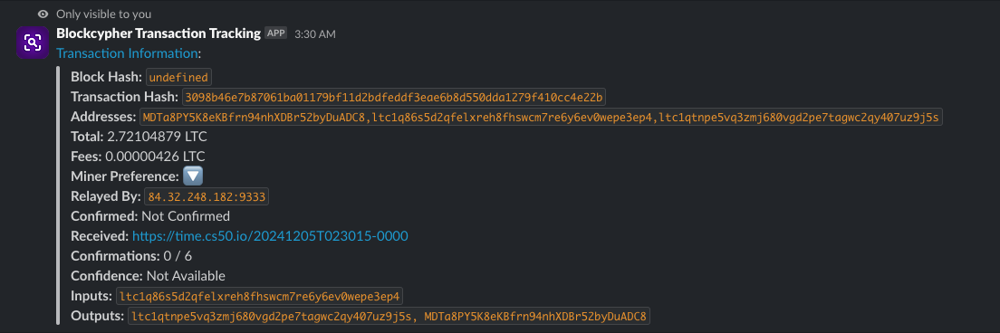

<a id="readme-top"></a>
[![Contributors][contributors-shield]][contributors-url]
[![Forks][forks-shield]][forks-url]
[![Stargazers][stars-shield]][stars-url]
[![Issues][issues-shield]][issues-url]


<!-- PROJECT LOGO -->
<br />
<div align="center">
  <a href="https://github.com/lcholdings/blockcypher-slack-bot">
    
  </a>

  <h3 align="center">BlockCypher Slack Bot</h3>

  <a align="center" href="https://slack.com/oauth/v2/authorize?client_id=2210535565.8113010338339&scope=commands&user_scope=">
    
  </a>

  <p align="center">
    Take your crypto transactions to your Slack chat.
    <br />
    <a href="https://slack.com/oauth/v2/authorize?client_id=2210535565.8113010338339&scope=commands&user_scope=">Add to workspace</a>
    ·
    <a href="https://github.com/LCHoldings/blockcypher-slack-bot/issues/new?labels=bug&template=bug-report---.md">Report Bug</a>
    ·
    <a href="https://github.com/LCHoldings/blockcypher-slack-bot/fork">Fork Project</a>
  </p>
</div>


<!-- ABOUT THE PROJECT -->
## 📝 About The Project



I made this project to learn more about the Slack API and how to create a Slack bot. The bot is made to be used in a workspace where you want to keep track of your crypto transactions. The bot uses the BlockCypher API to fetch information about transactions and addresses. The bot can be used to fetch information about a specific transaction or address. The bot can also be used to subscribe to a specific address and get updates when a new transaction is made.

The code is open-source and can be used by anyone who wants to learn more about the Slack API or how to create a Slack bot. The bot is also available to be added to your workspace if you want to use it using this link or finding it on the Slack marketplace. *still in review as of now*.

There is a Discord version of this bot available [here](https://github.com/LCHoldings/blockcypher-discord-bot) by [Cyber](https://github.com/cyberdev-tech) if you are interested in that instead!

<p align="right">(<a href="#readme-top">back to top</a>)</p>


### 🛠️ Made using

This section contains some of the most notable tools/libraries used in this project.

* [](https://slack.com)
* 
* 


<p align="right">(<a href="#readme-top">back to top</a>)</p>


<!-- GETTING STARTED -->
## 🏗️ Getting Started

How to run this project locally.

### Prerequisites

1. *Copy the `.env.example` file to `.env` and fill out the fields with your own information.*

```env
# The port the server will run on
PORT=3000
```

2. *Install Nodemon* (optional)
```sh
npm install -g nodemon
```


### Installation

_Below is an example of how you can instruct your audience on installing and setting up your app. This template doesn't rely on any external dependencies or services._


1. First of all, run the following command to install the necessary dependencies.
    ```sh
    npm install
    ```
2. Run the following command to start the dev server.
    ```sh
    nodemon
    ```
    or if you don't have nodemon installed, you can run the following command.
    ```sh
    npm run dev
    ```
3. Follow this tutorial to use Ngrok to expose your local server to the internet.
    - Sign up for an account on [Ngrok](https://ngrok.com/)
    - Download the Ngrok client and follow the instructions to set it up.
    - Run the following command to expose your local server to the internet. Where PORT is the port you are running the server on.
    ```sh
    ngrok http PORT
    ```
    - Copy the URL that is generated and use it in the next steps.

4. Create a Slack application
    - Go to the [Slack API](https://api.slack.com/apps) and create a new application.
    - Navigate to "App Manifest" and use this template:
    ```json
    {
        "display_information": {
            "name": "My Test Application",
            "description": "Sends information about a crypto transaction.",
            "background_color": "#400a6c",
            "long_description": ""
        },
        "features": {
            "bot_user": {
                "display_name": "My Test Application",
            },
            "slash_commands": [
                {
                    "command": "/transaction",
                    "url": "NgrokURLFromPreviousStep/get-transaction",
                    "description": "Gets data about a specific crypto transaction.",
                    "usage_hint": "[Crypto wallet/transaction/link] [send in channel - optional]",
                    "should_escape": false
                }
            ]
        },
        "oauth_config": {
            "scopes": {
                "bot": [
                    "commands"
                ]
            }
        },
        "settings": {
            "org_deploy_enabled": false,
            "socket_mode_enabled": false,
            "token_rotation_enabled": false
        }
    }
    ```
    - Save the changes and install the app to your workspace.
5. Go to your Slack workspace and use the command `/transaction` to test the bot!
6. Enjoy!
<p align="right">(<a href="#readme-top">back to top</a>)</p>


<!-- ROADMAP -->
## 🗺️ Roadmap

- [X] 🚢 Release project
- [ ] 📝 Add more commands
- [ ] 🧹 Code Cleanup
- [ ] 📚 Add more documentation
- [ ] 📦 Better user experience

<p align="right">(<a href="#readme-top">back to top</a>)</p>


<!-- CONTRIBUTING -->
## ⛑️ Contributing

Contributions are what make the open source community such an amazing place to learn, inspire, and create. Any contributions you make are **greatly appreciated**.

If you have a suggestion that would make the portfolio better, please fork the repo and create a pull request. You can also simply open an issue with the tag "enhancement".
Don't forget to give the project a star! Thanks!

1. Fork the Project
2. Change the project and add your files or changes (`git add *`)
3. Commit your Changes (`git commit -m 'Feat | Added XXXX to the XXX'`)
4. Push to the Branch (`git push`)
5. Open a Pull Request

### 🏆 Top contributors:

<a href="https://github.com/LCHoldings/blockcypher-slack-bot/graphs/contributors">
  
</a>

<p align="right">(<a href="#readme-top">back to top</a>)</p>


<!-- CONTACT -->
## 💌 Contact

Lazyllama - [@Lazyllamaa](https://discord.com/users/754965470888722484) - me@lazyllama.xyz

Project Link: [https://github.com/lcholdings/blockcypher-slack-bot](https://github.com/lcholdings/blockcypher-slack-bot)

<p align="right">(<a href="#readme-top">back to top</a>)</p>


<!-- ACKNOWLEDGMENTS -->
## 🌟 Acknowledgments

Thanks to the following people for their help and inspiration:

* [Readme Template](https://github.com/othneildrew/Best-README-Template)
* [Slack API](https://api.slack.com/)
* [Cyber](https://github.com/cyberdev-tech)
* [BlockCypher](https://www.blockcypher.com/)
<p align="right">(<a href="#readme-top">back to top</a>)</p>


<!-- MARKDOWN LINKS & IMAGES -->
<!-- https://www.markdownguide.org/basic-syntax/#reference-style-links -->
[contributors-shield]: https://img.shields.io/github/contributors/lcholdings/blockcypher-slack-bot.svg?style=for-the-badge
[contributors-url]: https://github.com/lcholdings/blockcypher-slack-bot/graphs/contributors
[forks-shield]: https://img.shields.io/github/forks/lcholdings/blockcypher-slack-bot.svg?style=for-the-badge
[forks-url]: https://github.com/lcholdings/blockcypher-slack-bot/network/members
[stars-shield]: https://img.shields.io/github/stars/lcholdings/blockcypher-slack-bot.svg?style=for-the-badge
[stars-url]: https://github.com/lcholdings/blockcypher-slack-bot/stargazers
[issues-shield]: https://img.shields.io/github/issues/lcholdings/blockcypher-slack-bot.svg?style=for-the-badge
[issues-url]: https://github.com/lcholdings/blockcypher-slack-bot/issues